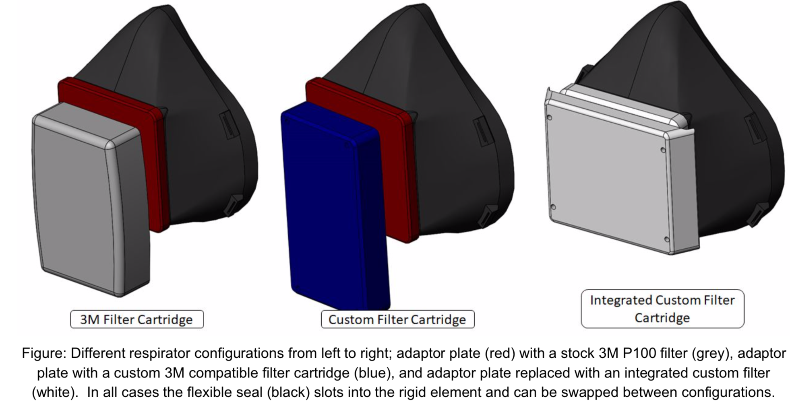

# JPL COVID-19-respirators
JPL designed and tested 3D printed respirators to help with the COVID-19 pandemic response.
The designs and instructions for three different types of respirators and the resulting detailed test data is published here.
In addition, designs and instructions for custom filters are also included.
You can review JPL's test results but these respirators are not certified by NIOSH or any medical institution, so use at your own risk.

These designs, instructions, and test data are released to Open Source with the hope that companies and individuals who have access to 3D printers, and who want to help, can print or create these for those who need them. ​We are purposefully not using materials in the normal medical supply chain as it should be kept free to create commercial and certified respirators. We expect and hope that these designs will be commented on and improved by everyone during and after this pandemic.
Below are three different respirator designs that are intended for different uses: The Performance Respirator, the Comfort Respirator, and the Conforming Respirator.

In addition, as there is a shortage or commercial filters, there is also a section for how to build your own filters that fit these respirators.
To decide which respirator is right for your use, please consider these questions:
 1. How are you planning to use the mask?
 2. What tradeoffs between comfort and sealing are right for you? (See the test results)
 3. What materials do you have available?
 4. Which printers do you have access to?
 5. What’s your face shape?
 6. What’s your face size?

# Design 1: JPL Performance Respirator
## Overview

The performance respirator design attempts to mimic the face seal geometry of commercial half-face respirators, such as those from 3M, to provide the highest level of fit performance. This is achieved through the use of a two piece assembly that consists of both a flexible and rigid element. The rigid element provides effective attachment for external filter cartridges while the flexible element has an internal lip to provide a conformal seal against the user’s face. The design also allows the front rigid section to be exchanged for compatibility with a wide range of different filter configurations while preserving the face seal and mounting straps.

The performance respirator design can be easily configured for use with different filter types by swapping the front rigid element. By swapping the front rigid element, the respirator can currently be arranged in two different configurations; front adapter compatible with COTS/custom filter cartridges or with a compact integrated custom filter.

 * Filter Cartridge Mount - In this configuration the rigid section consists of a cover plate that slots into the flexible face seal and provides a filter cartridge attachment point. Currently, the design is configured to be compatible with 3M filter cartridges but the intent is to provide options based on community input.
 * Integrated Custom Filter - In this configuration the front rigid section consists of two pieces with an integrated pleated filter (total surface area of 98 cm2) and provides the most compact arrangement that can fit under a standard face shield. Intake and exhaust both pass through the filter medium and are routed to the sides of the respirator. Additional information on the custom integrated filter can be found in the “Custom Filters” section.

The following subsections will describe the tools/equipment required, materials used, fabrication process, assembly guide.

## Tools and Equipment:
 * FDM 3D printer
     * Standard 0.4 mm print nozzle
     * Print area must be greater than 15x15 cm.
     * Capable of printing TPU (direct drive extruder recommended)
 * Xacto blade or similar
 * Calipers (optional)

## Materials Required:
 * PLA or PETG Filament - Used for rigid components
     * PETG is recommended for higher temperature and chemical resistance.
 * Shore 95A TPU Filament  - Used for flexible face seal.
     * Ninjaflex Cheetah and Polymaker Flex have been tested.
 * 3/8 “ Elastic Banding (36” Length) - Standard elastic banding for sewing is sufficient.
 * 3/16” Thick Foam or Equivalent - Used for the cartridge attachment point seal.
     * Compliant foam such as a contact shelf liner would work.
 * Filter Medium - An appropriate filter medium for use with the integrated filter.
     * HEPA vacuum bag material (Kenmore brand) currently recommended.
 * Note, currently *not* NIOSH certified for medical use.
     * Additional information in the custom filter section.

